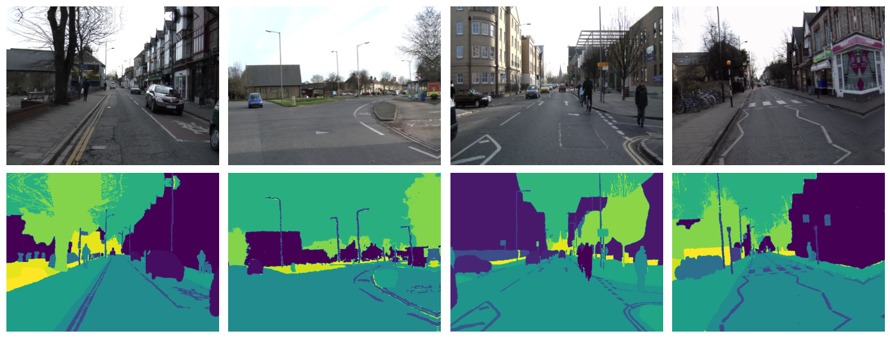
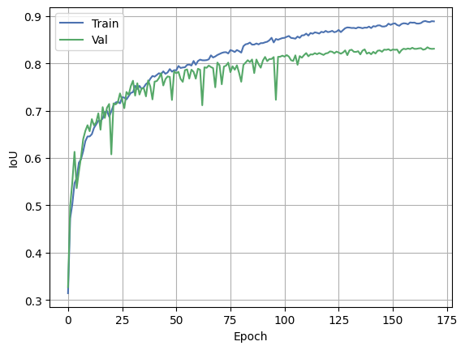
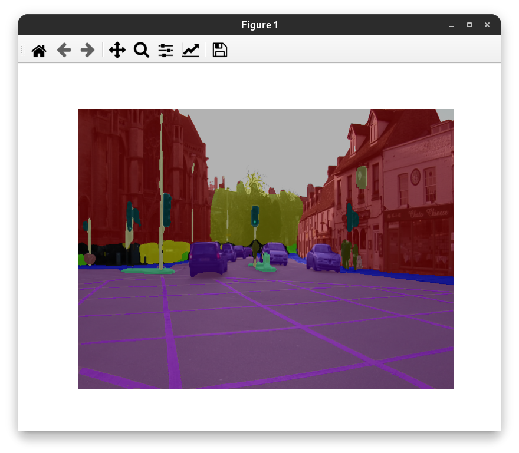

# U-Net for Semantic Segmentation on CamVid Dataset

[CamVid](https://mi.eng.cam.ac.uk/research/projects/VideoRec/CamVid/) (Cambridge-driving Labeled Video Database) is a road/driving scene understanding database which was originally captured as five video sequences with a 960×720 resolution camera mounted on the dashboard of a car. Those sequences were sampled adding up to 701 frames. Those stills were manually annotated with 32 classes: void, building, wall, tree, vegetation, fence etc.

## U-Net model

The model was implemented according to the original [paper](https://arxiv.org/abs/1505.04597):


The resnet34 from [timm](https://github.com/huggingface/pytorch-image-models) was choosen as a backbone. Total parameters 24436369.

## Training details

I used various augmentation techniques (such as ShiftScaleRotate, Blur, RGBShift etc.) from [albumentations](https://github.com/albumentations-team/albumentations) to improve training process. Random sampled, denormilized training batch:



I've downscaled the images to 640x480, preserving the same aspect ratio while reducing computational costs, and chose a combination of Dice loss and Focal loss as the cost function to enhance performance.

## Training results



Best validation IoU: 0.8327, test IoU: 0.7877

## Evaluation


<details>
  <summary>Side by side comparison</summary>

  

</details>

## Usage

```
options:
  -h, --help            show this help message and exit
  -t, --train           switch to training mode
  -b, --batch_size      set batch size
  -e, --epoch           set epochs number
  -l, --learning_rate   set learning rate
  -iw, --infer_width    set input width
  -ih, --infer_height   set input height
  -p, --params_path     set path to pretrained params
  -r, --root_dir        set path to data root directory
```

### Training

To train model, run the following command:

```bash
$ python main.py -t --batch_size BATCH_SIZE --epoch EPOCH --learning_rate LR
```

### Inference 

To evaluate the trained model, run:

```bash
$ python main.py
Inference mode
Path to image: CamVid/val/0016E5_05640.png       
```



## ONNX

The model was successfully converted to the ONNX format and evaluated with ONNXRuntime. All metrics align perfectly with those of the original model.